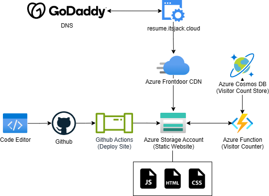

### ☁️ Cloud Resume Challenge | resume.itsjack.cloud
The Cloud Resume Challenge is a project designed to demonstrate cloud skills in a real-world scenario. In this Azure edition, I've utilized various Azure services to host and manage my online resume.

### 📃 Architecture 

### 🔧 Components
- **Azure Storage Account**: Hosts the static website (HTML/CSS/JavaScript).
- **Azure Functions**: Processes the retrieval and updating of visitor count data.
- **Azure Cosmos DB**: Stores visitor count data.
- **Azure CDN**: Distributes content globally for faster access & provides SSL certificate.
- **GoDaddy**: Domain registrar for my 'itsjack.cloud' domain.

### 📝 Learnings
This project was previously hosted and deployed through Azure DevOps, utilizing Azure Repos and Pipelines. Migrating this to Github and Github Actions proved a great learning experience, better understanding the Github Actions syntax and how it handles secrets. 
