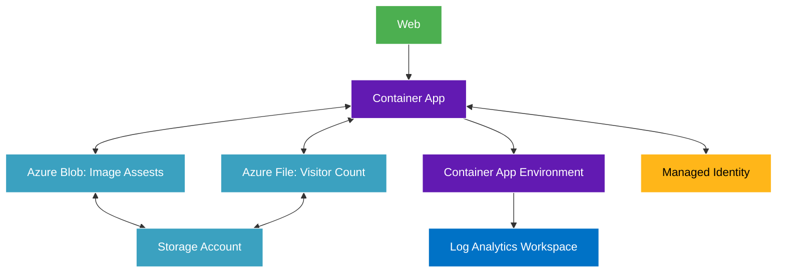

# Cloud Resume Challenge
Through the Cloud Resume Challenge, I've implemented a real-world solution that showcases my expertise with multiple Azure and AWS services throughout the years, demonstrating practical cloud architecture and deployment skills.

## Architecture

## Components
- **Azure Container App**: Serves web application and processes visitor count
- **Azure File Storage**: Persists visitor count
- **Azure Blob Storage**: Houses image assets for web application
- **Container App Environment**: Provides runtime context for container app
- **Log Analytics Workspace**: Retains log for my application
- **Managed Identity**: Allows container app to pull container images

## Learnings
My Cloud Resume has evolved significantly over time. Initially deployed in AWS using clickops back in 2021, utilizing services such as S3, Route53 and CloudFront. I later migrated to Azure using the equivalent services like Azure Storage Account and Azure Front Door. Most recently, I've transformed it into a containerized application using Azure Container Apps, which provides greater flexibility and scalability.

The entire infrastructure is now defined and deployed using Terraform as code, embracing infrastructure as code principles for consistent, repeatable deployments. This migration path from manual clickops to fully automated deployments demonstrates my growing expertise in cloud architecture and DevOps practices.

It was previously hosted and deployed through Azure DevOps with Azure Repos and Azure Pipelines, I've now migrated to GitHub and GitHub Actions. This transition provided valuable experience in understanding GitHub Actions syntax and its 'gotchas', further strengthening my CI/CD capabilities across different platforms.
